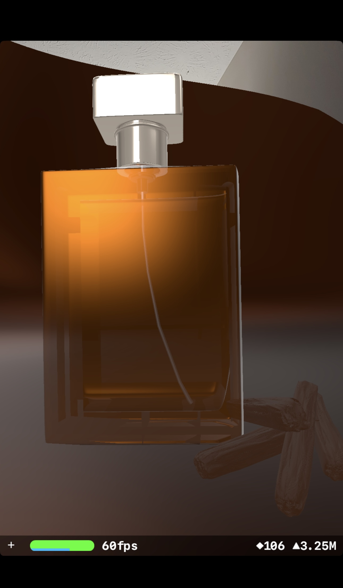

# EssenceAR-ARKit-3D-Perfume-Visualization-in-Augmented-Reality
EssenceAR — ARKit 3D Perfume Visualization in Augmented Reality

# 🌸 EssenceAR — ARKit 3D Perfume Visualization in Augmented Reality

Experience a realistic 3D **Perfume Bottle** rendered in real-world space using **ARKit** and **SceneKit**.  
This iOS app demonstrates interactive 3D model loading, placement, and rendering with Apple’s **ARKit framework**.

---

## ✨ Features
- Displays a **3D `.usdz` perfume model** using ARKit + SceneKit  
- Real-world **object placement and scaling**  
- **Lighting and reflections** for a realistic showroom experience  
- Written in **Swift / UIKit**

---

## 🧱 Tech Stack
- **Language:** Swift  
- **Frameworks:** ARKit, SceneKit, UIKit  
- **3D Model:** `Perfume.usdz`
---

## 📸 Screenshots

|  |  |
|:----------------------------------:|:----------------------------------:|
| *Model placement in AR* | *Realistic lighting and shadow effects* |

|  |  |
|:----------------------------------:|:----------------------------------:|
| *Rotation and focus* | *Real-world scale and positioning* |

---
